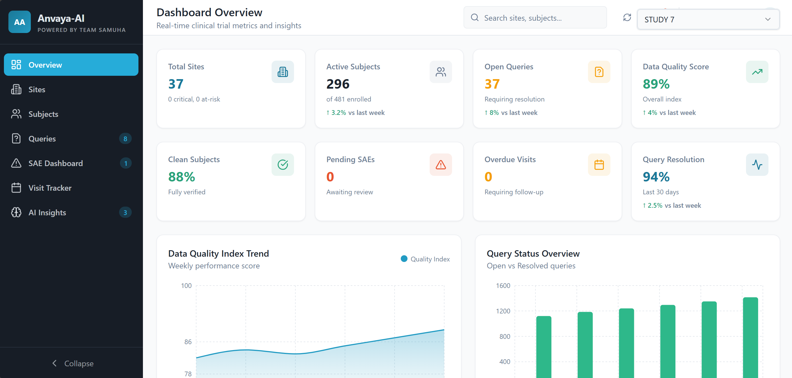
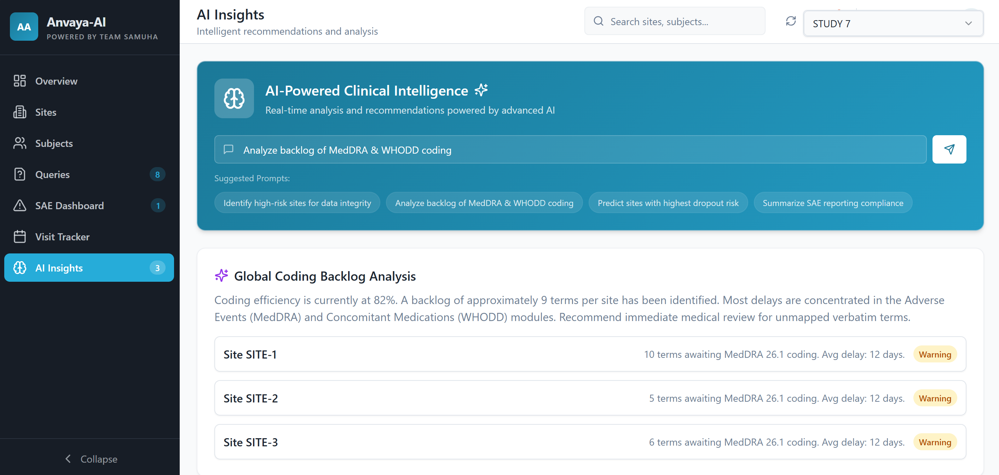

# Anvaya-AI

**Powered by Team Samuha**

Anvaya-AI is an advanced clinical trial intelligence platform designed to provide real-time visibility and predictive insights into clinical study performance. By integrating multi-source clinical data, Anvaya-AI empowers data managers and clinical leads to identify risks, monitor compliance, and ensure data integrity through an intuitive, AI-powered interface.

## 🖼️ Preview

<p align="center">
  
  
</p>

## 🚀 Key Features

- **Clinical Intelligence Dashboard**: A high-level overview of trial health, including active subjects, query density, and data quality scores.
- **AI Insights Engine**: Natural language analysis of study data to identify:
  - High-risk sites for data integrity.
  - MedDRA & WHODD coding backlogs.
  - Patient dropout and retention risks.
  - SAE reporting and regulatory compliance gaps.
- **Multi-Study Management**: Seeded randomization logic allows for consistent, study-specific data variations across the entire trial portfolio.
- **Automatic Data Processing**: Direct ingestion and parsing of standardized clinical datasets (EDC Metrics, Visit Projections, SAE Dashboards).
- **Responsive Analytics**: Deep dives into site-level performance, subject status tracking, and query resolution metrics.

## 🛠️ Tech Stack

- **Framework**: [Vite](https://vitejs.dev/) + [React](https://reactjs.org/)
- **Language**: [TypeScript](https://www.typescriptlang.org/)
- **Styling**: [Tailwind CSS](https://tailwindcss.com/)
- **State Management**: [TanStack Query (React Query)](https://tanstack.com/query/latest)
- **UI Components**: [Radix UI](https://www.radix-ui.com/), [Shadcn UI](https://ui.shadcn.com/)
- **Icons**: [Lucide React](https://lucide.dev/)
- **Data Engineering**: [XLSX](https://sheetjs.com/) for complex Excel parsing.

## 📂 Project Structure

- `src/services/dataService.ts`: Core logic for dataset processing and study variations.
- `src/components/sections/InsightsSection.tsx`: AI analysis engine and suggested prompts.
- `src/utils/excelParser.ts`: Utility for converting clinical Excel files to JSON.
- `public/dataset/`: Local storage for anonymized study files.

## 🏁 Getting Started

### Prerequisites

- [Node.js](https://nodejs.org/) (v18 or higher)
- [npm](https://www.npmjs.com/) or [bun](https://bun.sh/)

### Installation

1. Clone the repository:
   ```bash
   git clone https://github.com/Swayam8115/Anvaya-AI.git
   cd Anvaya-AI
   ```

2. Install dependencies:
   ```bash
   npm install
   ```

3. Start the development server:
   ```bash
   npm run dev
   ```

## 📊 Dataset Requirements

Anvaya-AI expects study data in the `public/dataset/` directory, organized by study folders. Supported file types include standardized exports for:
- EDC Metrics (Query counts, Subject status)
- Visit Projections (Overdue visits, scheduling)
- SAE/eSAE Dashboards (Regulatory reporting metrics)

---

Developed with ❤️ by **Team Samuha**.
